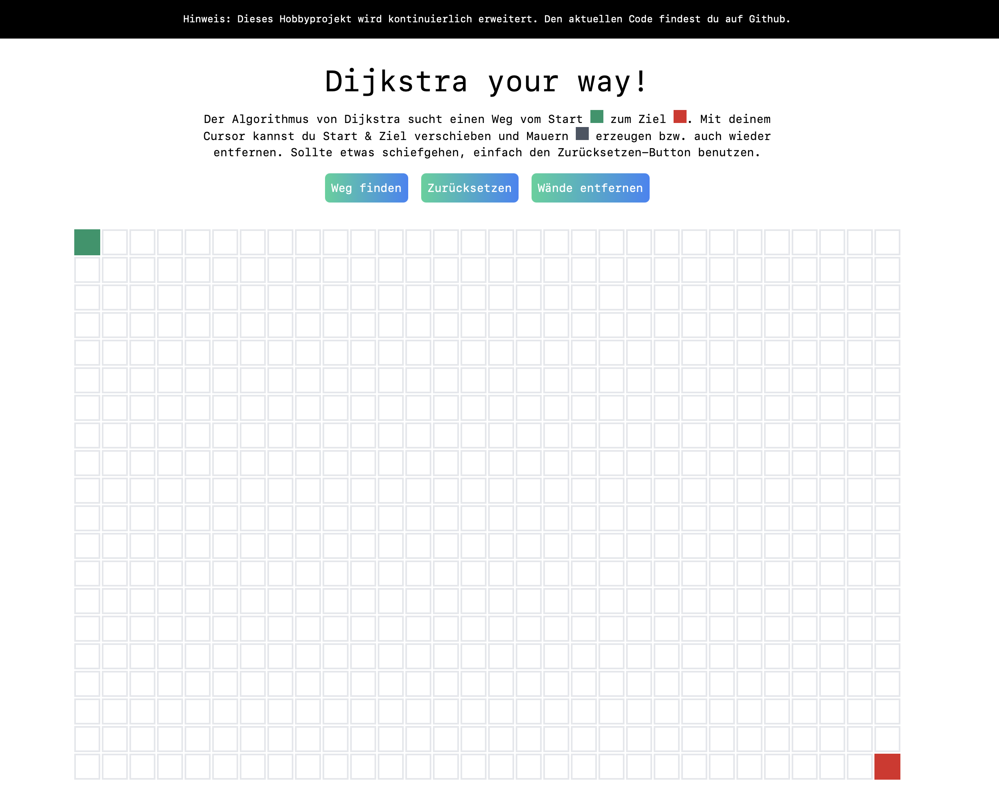

# Ein Spaßprojekt mit Next.js, Tailwind CSS und Framer Motion

Mithilfe von [Tailwind CSS](https://tailwindcss.com/) [(v2.2)](https://blog.tailwindcss.com/tailwindcss-2-2), [Next.js](https://next.js.org) und [Framer Motion](https://www.framer.com/motion/) wurde der Algorithmus von Dijsktra visualisiert.

